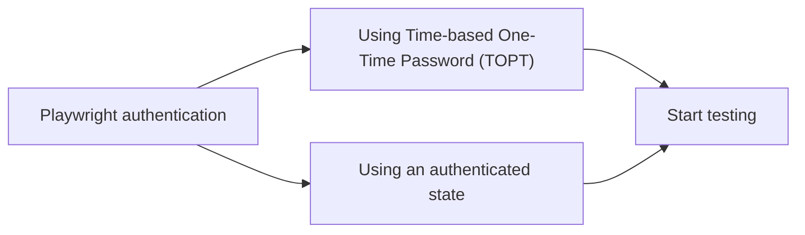

# Ensure quality in Power Apps by integrating automated testing with Playwright

&mdash; by [Elio Struyf](https://eliostruyf.com)

---
src: ./pages/hello.md
---

---
src: ./pages/sponsors.md
---

---
layout: section
---

# Low-code != No testing

---
layout: fact
---

# 🤷‍♀️ 🤷‍♂️

---
layout: section-left
image: happy.avif
imageBw: true
---

# Happy people

<style>
  .slidev-layout {
    h1 {
      @apply text-6xl;
      line-height: 1.1;
      margin-right: 0;
    }
  }
</style>

---
layout: image
image: money.avif
imageBw: true
position: center
invert: true
---

# Preventing money loss

<style>
  .slidev-layout {
    h1 {
      @apply text-7xl text-center;
    }
  }
</style>

---

# Benefits of Testing

- Improves application reliability.
- Reduces manual testing effort.
- Ensures consistent user experience.
- Automated testing can help catch issues early.

---
layout: section
invert: true
---

# Options for testing Power Apps

---

# Options for testing Power Apps

- Manual testing
- Test Studio
- Test Engine
- Other tools → Playwright

---

# Test Studio

A low-code solution to automate testing of canvas apps.

## The good

- Test step recorder
- Test editor
- Test playback

## The bad

- Power Fx 🙈
- Slow and not intuitive
- Not platform agnostic
- Debugging is hard

---

# Test Engine

Takes Test Studio to the next level by using Playwright.

## The good

- You can start with from Test Studio
- Connector mocking
- Screenshots

## The bad

- Still Power Fx 🙈
- Small community
- Limited functionality
- Debugging is hard

---

# Using Playwright

Playwright enables reliable end-to-end testing for modern web apps.

## The good

- No Power Fx 😜
- Became a standard
- Cross-browser / cross-platform / cross-language
- Full control over tests and scripts
- Debugging
- No vendor or platform lock-in

## The bad

- Requires coding

---
layout: section
---

# Using Playwright

---

# Getting started with Playwright

#### Install

```bash
npm init playwright@latest
```

<br />

#### Run your first test

```bash
npx playwright test
```

<br />

#### Opens the UI mode to run tests

```bash
npx playwright test --ui
```

<style>
  .slidev-layout .slidev-code code {
    font-size: 16px !important;
    line-height: 22px !important;
  }
</style>

---
layout: section
invert: true
---

# Recording / Codegen

<br/>

<code style="background:#D9D9D9 !important;padding:.25em;box-shadow: rgba(0, 0, 0, 0.15) 1.95px 1.95px 2.6px;">npx playwright codegen &lt;link to the app&gt;</code>

---
layout: section
invert: true
clicks: 1
---

# The app to test

<demotime click="1" id="open_power_app" />

---
layout: section
---

# Write your first test

---
layout: image-right
image: ./getting-started/website.png
backgroundSize: contain
---

# Using Playwright

#### Navigation

```ts
await page.goto('https://eliostruyf.com');
```

<br />

#### Get an element

```ts
const title = page.locator('header h2');
```

<br />

#### Test assertion

```ts
await expect(title).toHaveText('Elio Struyf');
```

<v-click>
  <Arrow v-bind="{ x1:345, y1:300, x2:500, y2:125, color: '#FF004C' }" />
</v-click>

<style>
  .slidev-layout .slidev-code-wrapper code {
    font-size: 14px !important;
    overflow-wrap: break-word !important;
    white-space: pre-wrap !important;
    line-height: 22px !important;
  }
</style>

---

# Validating the elements

#### Check if an element is visible

```tsx
await expect(locator).toBeVisible();
```

<br />

#### Check if an element contains text

```tsx
await expect(locator).toHaveText(/Elio/);
```

<br />

#### Check the number of elements

```tsx
await expect(locator).toHaveCount(5);
```

<style>
  h4 {
    margin-top: 10px;

    &:first-child {
      margin-top: 0;
    }
  }

  .slidev-layout .slidev-code code {
    font-size: 16px !important;
    overflow-wrap: break-word !important;
    white-space: pre-wrap !important;
    line-height: 22px !important;
  }
</style>


---
layout: fact
invert: true
---

# 👮‍♀️

---
layout: fact
invert: true
---

# AUTH

---
clicks: 1
---

# The options



References:

- [Using MFA](https://www.eliostruyf.com/automating-microsoft-365-login-mfa-playwright-tests/)
- [Using an auth session](https://www.eliostruyf.com/e2e-testing-mfa-environment-playwright-auth-session/)

<demotime click="1" id="open_auth" />

---
layout: fact
invert: true
---

# Power Apps is a weird beast

---
layout: fact
invert: true
---

# It uses magic 🪄

---
layout: fact
invert: true
---

# And it keeps a dinosaur alive 🦖

---

# The canvas (read iframe)


---


---


---

# Retrieving an element

```ts
// Get the iframe canvas
const iframe = page.frameLocator("iframe#fullscreen-app-host");
const publishedCanvas = iframe.locator("#publishedCanvas");

// Retrieve the control to test/use
const textInputControl = publishedCanvas.locator(`div[data-control-name='TextInput1']`);
const textInput = textInputControl.locator("input");

// Use the control
await textInput.fill("Hello World");
```

<style>
  .slidev-layout .slidev-code code {
    font-size: 16px !important;
    line-height: 22px !important;
  }
</style>

---
layout: section
---

# Making it easier with 

# `playwright-m365-helpers`

---
clicks: 1
---

# Using the Playwright helpers

```ts
// Get the iframe canvas
const appFrame = await getAppFrame(page);

// Retrieve the control to test/use
const textInput = getInput(appFrame, "TextInput1");

// Use the control
await textInput.fill("Hello World");
```

<style>
  .slidev-layout .slidev-code code {
    font-size: 16px !important;
    line-height: 22px !important;
  }
</style>

<demotime click="1" id="start_tests_and_open" />

---
layout: fact
---

# 🎛️ Control your tests

---
layout: fact
---

# 🐸 → 💋 → 🤴

---
layout: fact
---

# 🐸 → 💋 → 💩

---
layout: fact
---

# 🎭 Mock your connectors

---

# Power Apps Connectors are ... APIs 🤯


---

# Look into the headers 🕵


<v-click>
  <Arrow v-bind="{ x1:225, y1:225, x2:410, y2:165, color: '#FF004C' }" />
  <Arrow v-bind="{ x1:225, y1:275, x2:330, y2:250, color: '#FF004C' }" />
</v-click>

---
clicks: 1
---

# 🎭 Mock a connector

- Get the connector ID
- Prepare the data

<br />

```ts
await mockConnector(
  page,
  "sharepointonline/4aee3a63496d4e3f998c3910ba712bf2",
  { value: [] },
  "GET"
);
```

<style>
  .slidev-layout .slidev-code code {
    font-size: 16px !important;
    line-height: 22px !important;
  }
</style>

<demotime click="1" id="mocking_your_connector" />

---
layout: fact
invert: true
---


---
layout: fact
---

# Naming conventions

---

# Give meaningful names to screens and controls

- Default names like `Button1`, `Screen2`, or `Label3` make test scripts hard to read.
- Use descriptive, stable names:

  ✅ `SubmitButton`, `LoginScreen`, `UserEmailInput`

---
layout: fact
---

# Test on Test

---
layout: fact
---

# Mock your connectors to make your tests more reliable

---
layout: fact
---

# ⛓️‍💥 Break it! 

---
layout: fact
---

# 🚀 Shipping == Testing

---
layout: fact
---

# 🔮 The future

---

# Next steps

- Automating CI/CD
- Reporting on CI/CD, mail, or MS Teams
- Scheduled tests
- ...

<br />

Refrences:

- [playwright-mail-reporter](https://www.npmjs.com/package/playwright-mail-reporter)
- [playwright-msteams-reporter](https://www.npmjs.com/package/playwright-msteams-reporter)
- [github-actions-reporter](https://www.npmjs.com/package/@estruyf/github-actions-reporter)

---
src: ./pages/thanks.md
---

---
src: ./pages/end.md
---